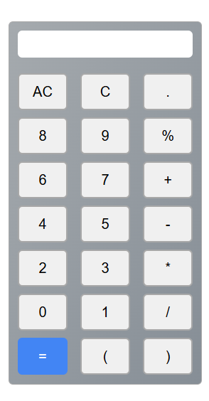

# Altamash Calculator

A responsive and user-friendly calculator web app built with HTML, CSS, and JavaScript. This calculator performs basic arithmetic operations and features a clean, modern UI.

## Preview
You can see the live demo <a href="https://calculator-one-zeta-44.vercel.app/" target='_blank'>Here</a>

## Features
Basic arithmetic operations: Addition, subtraction, multiplication, division

Responsive design — Works seamlessly on desktop and mobile

Interactive buttons with visual feedback

Keyboard input support — Type directly on the keyboard to perform calculations

Clean and minimalistic UI — Simple and easy-to-use interface

Clear button (C) — Clears the last entered value

All Clear button (AC) — Clears the entire input

Bracket support: Use parentheses to control operation order

Press Enter or equal button to calculate — Pressing the Enter key or equal button evaluates the expression in the input field

## Built With

HTML5 for the structure and layout.

CSS3 for styling and responsive design.

JavaScript (Vanilla) for the interactivity and functionality.

## ScreenShot

